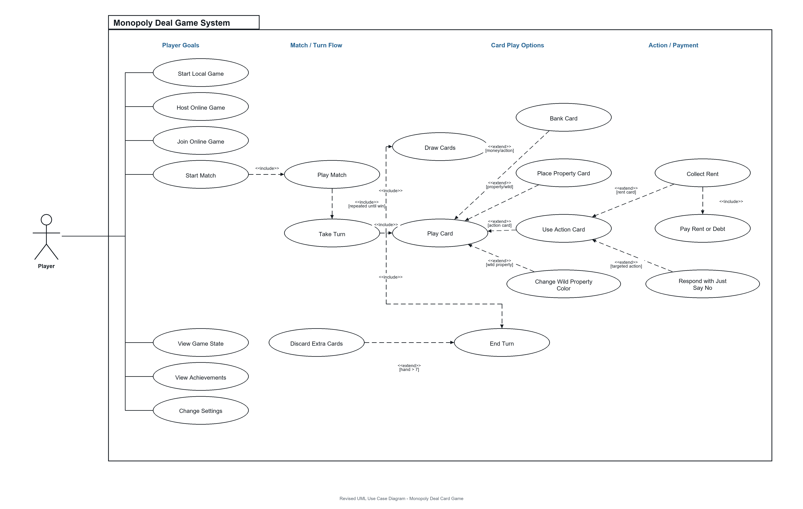

# Phase 1 Feedback Response

This document summarizes how the team responded to the Phase 1 feedback before the final interview.

## Summary

Overall, we made the following changes based on the feedback:

- Functional requirements: TODO - add a short summary after the action card requirement section is revised.
- Non-functional requirements: TODO - add a short summary after the measurable acceptance criteria are revised.
- Use case diagram: revised the system boundary, removed `Game System` as an actor, removed internal system logic from the user-goal level, and improved the include/extend relationships by adding a clearer `Play Match -> Take Turn -> Draw Cards / Play Card / End Turn` structure.
- Sequence diagram: TODO - add a short summary after the sequence diagram is revised.
- Class diagram: TODO - add a short summary after the class diagram is revised.

## Functional Requirements Revision

This is the revised functional requirements section.

[Insert the revised functional requirements table or screenshot here.]

Explanation:

 - Explain how the action card behaviours were described in more detail, including their conditions, effects, and outcomes.

## Non-Functional Requirements Revision

This is the revised non-functional requirements section.

[Insert the revised non-functional requirements table or screenshot here.]

Explanation:

## Use Case Diagram Revision

This is the revised use case diagram.

Explanation:

- **System boundary and actor**

  In the revised use case diagram, `Monopoly Deal Game System` is shown as
  the system boundary instead of an actor. This fixes the original problem
  where `Game System` was incorrectly placed outside the system.

  The only external actor is `Player`, because all visible interactions are
  initiated by players. Host and guest are treated as different online roles
  of the same actor, not as separate external systems.

- **Player-level goals**

  The left side of the diagram focuses on user goals, such as starting a
  local game, hosting or joining an online game, starting a match, viewing
  the game state, viewing achievements, and changing settings.

  These are visible goals from the player's perspective, rather than internal
  system operations.

- **Match and turn structure**

  The match flow was revised so that a whole match is not shown as a single
  one-time turn sequence.

  `Start Match` includes `Play Match`, because starting a match leads into the
  main game flow. `Play Match` includes `Take Turn`, and the turn repeats until
  a player wins.

  `Take Turn` then includes `Draw Cards`, `Play Card`, and `End Turn`, because
  these are the normal steps inside one turn. This better represents the
  repeated turn-based structure of Monopoly Deal.

- **Include and extend relationships**

  Conditional behaviours are represented with `extend`.

  `Discard Extra Cards` extends `End Turn` because it only happens when the
  player has more than seven cards at the end of the turn.

  `Bank Card`, `Place Property Card`, `Use Action Card`, and
  `Change Wild Property Color` extend `Play Card` because they are different
  possible outcomes depending on the selected card type.

  `Collect Rent` extends `Use Action Card` because it only occurs when a rent
  card is played. `Respond with Just Say No` extends `Use Action Card` because
  it only occurs when a targeted action card is played against another player
  and that player can respond.

- **Payment flow**

  `Pay Rent or Debt` is shown as part of the action/payment flow rather than
  as a top-level entry goal.

  It is connected to `Collect Rent` with an include relationship because
  payment is required once rent collection is successfully triggered.

  Since the diagram uses a single `Player` actor, the explanation clarifies
  that the collecting player and the paying player can be different player
  instances in the same match.

- **Removed internal logic**

  Internal operations from the original diagram, such as shuffling cards,
  validating actions, resolving card effects, updating game state, and checking
  the win condition, were removed as independent use cases.

  These are still important system responsibilities, but they are internal
  logic rather than direct player goals.

## Sequence Diagram Revision

This is the revised sequence diagram.

[Insert the revised sequence diagram here.]

Explanation:

## Class Diagram Revision

This is the revised class diagram.

[Insert the revised class diagram here.]

Explanation:

## Demo Notes

This is the revised demo plan.

[Insert the final demo flow or screenshot list here.]

Explanation:
